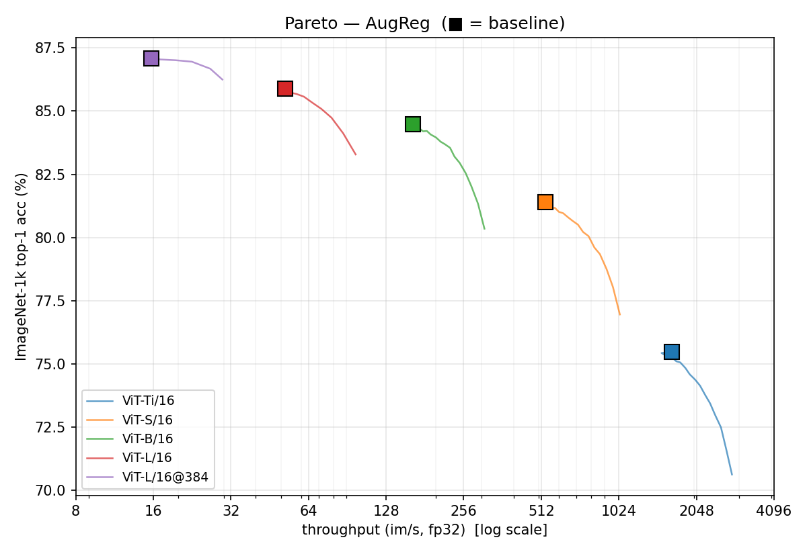

# ToMe 재현

**Token Merging: Your ViT But Faster** (Bolya et al., ICLR 2023) 재현.
ImageNet-1k val 50K 전체 사용.

논문: [arxiv.org/abs/2210.09461](https://arxiv.org/abs/2210.09461) · 원본 코드:
[facebookresearch/ToMe](https://github.com/facebookresearch/ToMe)

---

## 재현 범위

| 논문 항목                                    | 결과 파일                                              |
| -------------------------------------------- | ------------------------------------------------------ |
| Table 1 (a-f) — ViT-L/16 MAE r=8 ablation    | `results/E4_ablation.json` + `E4_ablation_augreg.json` |
| Table 2 — matching algorithm 비교            | `results/E5_matching.json`                             |
| Table 8 / Fig 3a — AugReg sweep              | `results/E1_augreg.json`                               |
| Table 9 / Fig 3b — SWAG sweep                | `results/E3_swag.json`                                 |
| Table 10a / Fig 3c — MAE off-the-shelf sweep | `results/E2_mae.json`                                  |

**재현 품질**: paper r=0 baseline 전부 ±0.1 acc 이내 재현. Bipartite matching
(논문 핵심 contribution) 모든 모델 family에서 충실히 재현. r별 drop과 speedup
모두 paper와 일치. 절대 throughput은 하드웨어 차이로 paper의 ~50% (A4000 vs
V100; attention이 memory bandwidth bound).

**Seed**: 모든 실험 `SEED=0` 고정.

## 추가 실험 (논문 비판 분석용)

본 재현 외에 논문 비판 분석을 위한 추가 실험을 수행 (분석 내용 자체는 별도
발표 자료):

- **E4 stress test** — ViT-B MAE r=16 ablation. Table 1 design choice가 다른
  (model, r)에서도 같은 ranking인지 측정. → `results/E4_ablation_base_r16.json`
- **E6 kmeans variants** — Table 2의 kmeans baseline에서 init과 convergence
  설정 변경 효과 측정 (linspace / random+clsfix / kmeans++ + full converge).
  → `results/E6_kmeans_variants.json`, `results/E6_kmeans_clsfix.json`

재현 명령과 환경변수 (`MODEL_SIZE`, `R_VALUE`, `ALGOS`, `OUT_NAME`)는
[`RUNBOOK.md`](RUNBOOK.md) §3 (Launch experiments) + §5 (Env var reference) 참고.

## 핵심 재현 결과 (요약)

### r=0 baseline 정확도 — paper와 ±0.1 이내 매치

| backbone family | model        | our acc | paper acc | Δ     |
| --------------- | ------------ | ------- | --------- | ----- |
| AugReg          | ViT-Ti/16    | 75.48   | 75.50     | -0.02 |
| AugReg          | ViT-S/16     | 81.40   | 81.41     | -0.01 |
| AugReg          | ViT-B/16     | 84.47   | 84.57     | -0.10 |
| AugReg          | ViT-L/16     | 85.89   | 85.82     | +0.07 |
| AugReg          | ViT-L/16@384 | 87.08   | 86.92     | +0.16 |
| MAE             | ViT-B/16     | 83.72   | 83.62     | +0.10 |
| MAE             | ViT-L/16     | 85.95   | 85.66     | +0.29 |
| MAE             | ViT-H/14     | 86.90   | 86.88     | +0.02 |
| SWAG            | ViT-B/16@384 | 85.29   | 85.30     | -0.01 |
| SWAG            | ViT-L/16@512 | 88.07   | 88.06     | +0.01 |
| SWAG            | ViT-H/14@518 | 88.55   | 88.55     | -0.00 |

### Table 1 / Table 2 (ViT-L MAE, r=8)

- **Table 1 default** (k / cosine / mean / wavg / alternating, no prop_attn):
  our **84.32** vs paper 84.25 (+0.07)
- **Table 2 bipartite matching**: our **84.20** vs paper 84.25 (-0.05)
- **Table 2 greedy matching**: our 84.18 vs paper 84.36 (-0.18)

### Cross-model throughput-vs-accuracy overlay (paper Fig 3a 재현)



ViT-Ti/S/B/L/L@384 baseline (■) + 각 모델의 ToMe sweep curve. log-scale x축으로
모든 모델 가시화. MAE/SWAG 동일 형식은 `results/figures/pareto_mae.png`,
`pareto_swag.png` 참고.

## 하드웨어

- **GPU**: NVIDIA RTX A4000 (16GB GDDR6, 메모리 대역폭 ~448 GB/s, Ampere)
- **소프트웨어**: PyTorch 1.12.1 + CUDA 11.3
- **정밀도**: fp32 inference. Batch size는 (model, r)별 throughput 최대화로 auto-tune

논문 측정은 V100 (HBM2, ~900 GB/s — 우리의 약 2배). 절대 throughput 값은
다르나 accuracy는 직접 비교 가능.

## Setup

### 1. Upstream ToMe 라이브러리 clone

원본 ToMe 코드는 본 레포에 포함 안 됨 (CC-BY-NC, .gitignore됨). 직접 clone:

```bash
git clone https://github.com/facebookresearch/ToMe.git ToMe-main
```

`ToMe-main/`에 위치시키면 모든 experiment 스크립트가 자동 인식
(`sys.path.insert(0, ...)`로 import).

### 2. Docker 환경 빌드

```bash
./docker_run.sh build      # 최초 1회 image build
./docker_run.sh shell      # 컨테이너 진입
```

### 3. 데이터 + 체크포인트 (repo 미포함)

**ImageNet-1k val 50K (~7GB)**

공식 출처에서 다운로드. 자세한 절차는 `imagenet_download_guide.md` 참고.
기본 위치는 `data/imagenet/val/` (class별 폴더 1개). Eval 스크립트는
이 경로를 읽음. 또는 `$IMAGENET_VAL` 환경변수로 override.

**모델 체크포인트 (총 ~16GB)**

`checkpoints/`에 배치:

| 파일                          | 출처                                                                                                     |
| ----------------------------- | -------------------------------------------------------------------------------------------------------- |
| `mae_finetuned_vit_base.pth`  | [facebookresearch/mae](https://github.com/facebookresearch/mae#fine-tuning-with-pre-trained-checkpoints) |
| `mae_finetuned_vit_large.pth` | (동일)                                                                                                   |
| `mae_finetuned_vit_huge.pth`  | (동일)                                                                                                   |

AugReg, SWAG 모델은 첫 실행 시 `timm` / `torch.hub`로 자동 다운로드.

### 4. 실험 실행

각 `experiments/E*.py`는 독립 실행 가능. 자세한 절차, 환경변수 옵션, 결과 위치는
[`RUNBOOK.md`](RUNBOOK.md) 참고.

최소 예시:

```bash
nohup python experiments/E2_mae.py > logs/E2_mae.stdout 2>&1 &
tail -f logs/E2_mae.stdout
```

결과는 `results/E*.json`에 저장.

### 5. 그림 재생성

```bash
python experiments/analyze.py
```

`results/figures/*.png`를 JSON에서 재생성. 그림을 인터랙티브하게
조정하려면 `experiments/make_figures.ipynb` 사용.

## 인용

```bibtex
@inproceedings{bolya2023tome,
  title={Token Merging: Your ViT but Faster},
  author={Bolya, Daniel and Fu, Cheng-Yang and Dai, Xiaoliang and
          Zhang, Peizhao and Feichtenhofer, Christoph and Hoffman, Judy},
  booktitle={ICLR},
  year={2023}
}
```

## 라이선스

원본 ToMe 라이브러리 (`ToMe-main/`, 본 레포 미포함)는
[facebookresearch/ToMe](https://github.com/facebookresearch/ToMe)에서 clone.
원본 라이선스 CC-BY-NC 4.0 적용. 본 레포의 신규 코드 (`experiments/`,
`results/`, 문서)는 연구 재현 목적으로 제공.

## AI Tool Usage Statement

본 프로젝트는 다음 AI 도구를 사용하였음:

- **Claude (Anthropic, Sonnet 4.5 / Opus 4.7, Claude Code CLI)** —
  - 재현 및 추가 실험 코딩 + 디버깅
  - 시각화
  - 마크다운 작성

생성된 모든 코드와 문서 내용은 본인이 직접 검토 후 측정 결과, 논문과 대조하여 검증함.
